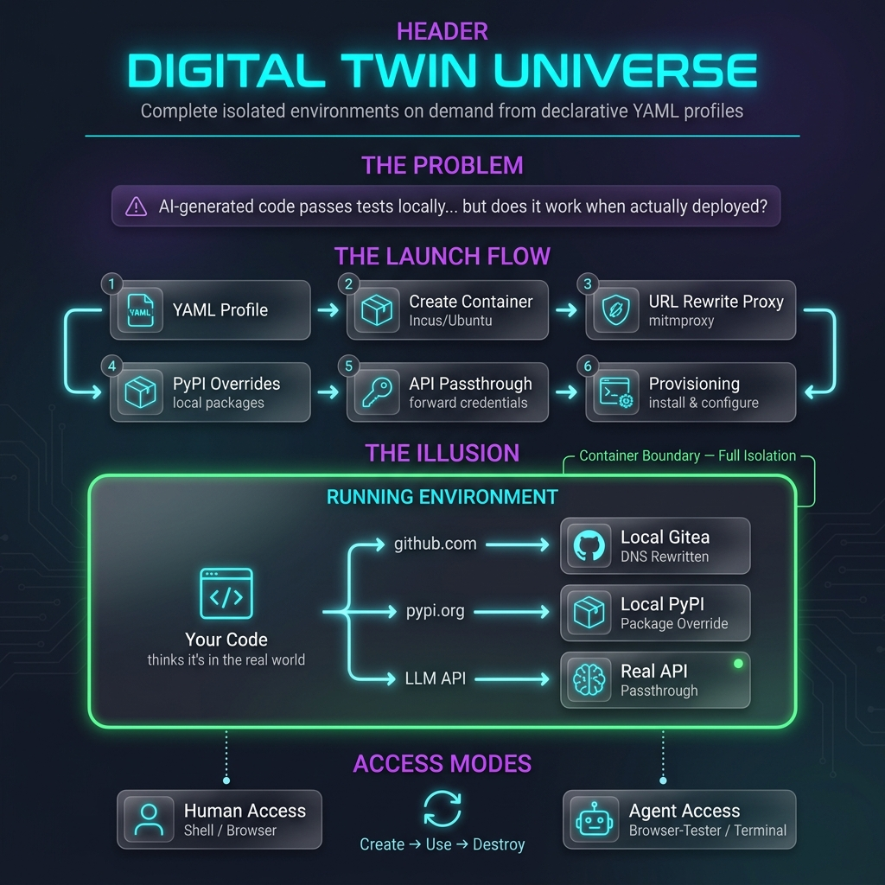
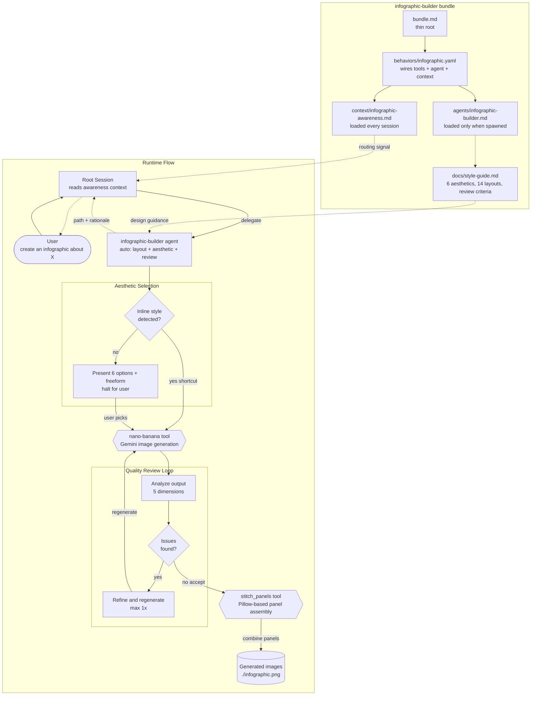
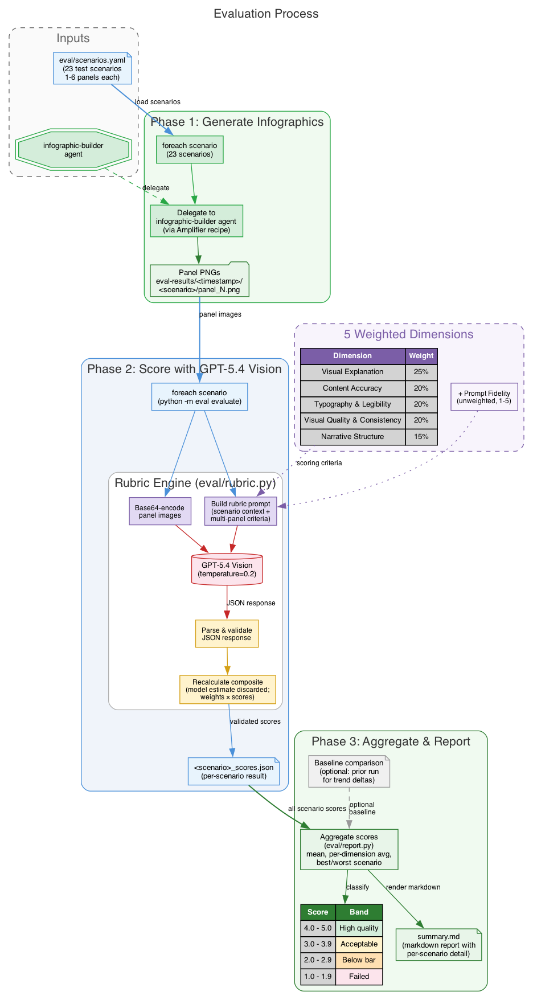

# infographic-builder

Say what you want, get a finished infographic.

<table>
  <tr>
    <td></td>
    <td></td>
    <td></td>
  </tr>
  <tr>
    <td align="center"><em>Claymation Studio</em></td>
    <td align="center"><em>Bold Editorial (3 panels)</em></td>
    <td align="center"><em>Dark Mode Tech</em></td>
  </tr>
</table>

The agent handles layout, color, typography, and multi-panel composition automatically.
You steer with plain English.

## Get started

```bash
amplifier bundle add git+https://github.com/singh2/infographic-builder@main --app
```

Set your Google API key (powers the image generation):

```bash
export GOOGLE_API_KEY=your-key-here   # add to ~/.zshrc to make permanent
```

Run `amplifier run` and try it:

```
"create an infographic about the water cycle"
```

You'll get back `.png` file(s), a design rationale, and suggestions for refinement.

## Examples

| Say this | What happens |
|----------|--------------|
| "Create an infographic about the water cycle" | Single-panel, auto-selected layout |
| "Make an infographic about the history of the internet" | Auto-splits into multiple panels when content is dense |
| "Create a claymation infographic about how DNS works" | Detects style inline, skips aesthetic selection |
| "Create an infographic about quarterly metrics" | Presents 6 aesthetic options + freeform, waits for your pick |

<details>
<summary>More ways to steer</summary>

- "make it bold and colorful" / "keep it minimal and corporate" -- style direction
- "use a timeline layout" -- override the automatic layout choice
- "single panel only" -- force one image even for dense topics
- "make it a 4-panel infographic" -- set an explicit panel count (up to 6)
- "make it claymation" / "dark mode tech" -- choose a curated aesthetic
- "2" (when prompted) -- pick an aesthetic by number
- "skip the review" -- faster generation, skip the quality check

</details>

## What the agent does

- **Picks the best layout** for your content (14 layout types: process flow, comparison, timeline, hierarchy, cycle, statistics, and more)
- **Presents aesthetic options** -- 6 curated styles from Clean Minimalist to Lego Brick Builder, plus freeform
- **Splits complex topics** into multiple panels when there's too much for one image (up to 6 panels)
- **Reviews its own output** and refines if it spots issues (missing content, poor readability, wrong layout)
- **Stitches multi-panel sets** into a single combined image
- **Keeps multi-panel sets visually consistent** using reference image chaining

### For bundle authors

Add to your `bundle.md`:

```yaml
includes:
  - bundle: git+https://github.com/singh2/infographic-builder@main
```

No need to separately add `amplifier-foundation` -- it's included.

## Where output goes

Generated images are saved to the current working directory:

| Output | Filename |
|--------|----------|
| Single-panel infographic | `./infographic.png` |
| Multi-panel set | `./infographic_panel_1.png`, `./infographic_panel_2.png`, ... |
| Stitched composite | `./infographic.png` (all panels combined vertically) |

## How it works

```
1. You describe what you want
2. Agent analyzes content density --> picks single or multi-panel
3. Agent recommends a layout and presents 6 aesthetic options (or detects your inline style)
4. Agent designs layout, palette, typography using your chosen aesthetic template
5. Agent generates image(s) via Gemini (nano-banana tool)
6. Agent reviews output (including aesthetic fidelity) and refines if needed
7. For multi-panel: agent stitches panels into a combined image
8. You get the .png file(s) + design rationale + suggestions
```

The agent's design decisions are guided by a comprehensive style guide
(`docs/style-guide.md`) covering 14 layout types, prompt engineering rules,
decomposition heuristics, multi-panel composition protocols, and quality
review criteria.

## Architecture


<details>
<summary>Mermaid version (click to expand)</summary>



</details>

## Evaluation harness

The project includes a standalone evaluation system for scoring generated infographics
against a weighted rubric. This is separate from the Amplifier bundle -- it's a Python
package (`infographic-eval`) that uses GPT-5.4 vision to assess quality.

Requires `OPENAI_API_KEY` set in your environment.



### How evaluation works

1. **23 test scenarios** (`eval/scenarios.yaml`) spanning 1-6 panel infographics
2. **Generate**: The infographic-builder agent creates images for each scenario
3. **Score**: GPT-5.4 vision evaluates each image against a 5-dimension rubric
4. **Report**: Scores are aggregated into a markdown summary with per-scenario detail

### Scoring rubric

| Dimension | Weight | What it measures |
|-----------|--------|------------------|
| Visual Explanation | 25% | How effectively visuals communicate the core idea |
| Content Accuracy | 20% | Factual correctness, absence of hallucinated data |
| Typography & Legibility | 20% | Font hierarchy, contrast, readability |
| Visual Quality & Consistency | 20% | Polish, palette coherence, icon consistency |
| Narrative Structure | 15% | Logical flow, entry/exit points, story progression |

Plus an unweighted **prompt fidelity** score (1-5) measuring adherence to the original brief.

The model's own composite estimate is always discarded -- `parse_scores()` recalculates
it from dimension scores × weights as a guard against model self-reporting bias.

### Quality bands

| Score | Band |
|-------|------|
| 4.0 - 5.0 | High quality |
| 3.0 - 3.9 | Acceptable |
| 2.0 - 2.9 | Below bar |
| 1.0 - 1.9 | Failed |

### Running evaluations

```bash
# Score a single scenario
python -m eval evaluate \
  --scenario-file eval/scenarios.yaml \
  --scenario-name dns \
  --image-dir eval-results/run-name/dns/ \
  --output eval-results/run-name/dns/dns_scores.json

# Generate a markdown report from all scored scenarios
python -m eval report \
  --run-dir eval-results/run-name/ \
  --baseline-dir eval-results/previous-run/   # optional: adds trend deltas
```

Or run the full pipeline as an Amplifier recipe:

```bash
amplifier run
# Say: "execute recipes/evaluate.yaml"
```

The recipe automates: setup → load scenarios → generate infographics (foreach) →
evaluate each scenario → generate summary report.

## Project structure

```
infographic-builder/
|-- bundle.md                              # thin root: foundation + behavior
|-- behaviors/
|   +-- infographic.yaml                   # wires tools + agent + context
|-- agents/
|   +-- infographic-builder.md             # the expert agent (context sink)
|-- context/
|   +-- infographic-awareness.md           # thin pointer loaded every session
|-- docs/
|   |-- style-guide.md                     # design knowledge: aesthetics, layouts, quality criteria
|   |-- architecture.dot                   # Graphviz source for architecture diagram
|   |-- architecture.png                   # rendered architecture diagram
|   |-- evaluation.dot                     # Graphviz source for evaluation process diagram
|   |-- evaluation.png                     # rendered evaluation process diagram
|   +-- plans/                             # design documents
|-- modules/
|   +-- tool-stitch-panels/                # Python module: combines panels into one image
|       |-- pyproject.toml
|       +-- amplifier_module_tool_stitch_panels/
|           +-- __init__.py                # StitchPanelsTool + mount() entry point
|-- eval/
|   |-- __init__.py                        # package marker
|   |-- __main__.py                        # enables python -m eval
|   |-- cli.py                             # evaluate + report subcommands
|   |-- rubric.py                          # scoring rubric, prompt builder, GPT-5.4 evaluation
|   |-- report.py                          # score aggregation + markdown report generation
|   +-- scenarios.yaml                     # 23 test scenarios (1-6 panels)
|-- recipes/
|   |-- evaluate.yaml                      # full evaluation pipeline recipe
|   |-- generate-sample-gallery.yaml       # batch-generate 14 scenarios (Gemini Pro)
|   +-- generate-sample-gallery-3.1-flash.yaml  # same scenarios (Gemini 3.1 Flash)
|-- tests/                                 # pytest test suite
|-- eval-results/                          # persisted evaluation runs
+-- samples/                               # generated gallery output (gitignored)
    |-- pro/                               # Gemini Pro outputs
    +-- 3.1-flash/                         # Gemini 3.1 Flash outputs
```

## Roadmap

**Shipped -- Style System**:
Six curated aesthetics (Corporate Clean, Bold Editorial, Claymation 3D, Neon Data,
Warm Organic, Technical Blueprint) with full prompt templates, wired through agent
step 3d. Layout selection covers 14 types.

**Planned -- User-Provided Reference Images**:
When a user says "make it look like this" and provides an image, the agent should
pass it as `reference_image_path` to `nano-banana.generate`. The mechanism already
exists in the tool but the agent workflow doesn't handle user-supplied style
references yet.

**Planned -- Browsable Style Catalog**:
A static site showcasing all aesthetic × layout combinations so users can browse
what's possible before asking for a specific style.

## Troubleshooting

| Problem | Fix |
|---------|-----|
| "API key" error on first run | `export GOOGLE_API_KEY=your-key` -- the #1 first-run issue |
| Image text is garbled or unreadable | Simplify: fewer data points, shorter labels, larger text emphasis in your prompt |
| Wrong layout for your content | Tell it explicitly: "use a timeline layout" or "make it a comparison" |
| Too many panels (or too few) | Specify: "make it a 2-panel infographic" -- explicit count always wins |
| Slow generation | Say "skip the review" to skip the quality check pass |

## Local development

### Setup

Point Amplifier at the local checkout:

```yaml
# .amplifier/settings.yaml (in this repo, already gitignored)
default_bundle: file:///Users/YOU/path/to/infographic-builder
```

Or use source override if you already have a default bundle:

```yaml
# ~/.amplifier/settings.yaml
sources:
  infographic-builder: file:///Users/YOU/path/to/infographic-builder
```

### Prerequisites check

```bash
echo $GOOGLE_API_KEY   # should print your key
amplifier --version
```

### Smoke tests

```bash
cd /path/to/infographic-builder

# Test 1: Simple topic (should auto single-panel)
amplifier run
# Say: "Create an infographic about the water cycle"
# Expected: single panel, auto layout, quality review, design rationale

# Test 2: Complex topic (should auto multi-panel)
amplifier run
# Say: "Create an infographic about the complete history of the internet"
# Expected: agent auto-decomposes into multiple panels, stitches them together

# Test 3: User override -- explicit panel count
amplifier run
# Say: "Create a 3-panel infographic about how DNS works"
# Expected: exactly 3 panels

# Test 4: User override -- force single panel
amplifier run
# Say: "Create a single-panel infographic about climate change impacts"
# Expected: one image even though topic is dense

# Test 5: Aesthetic selection flow
amplifier run
# Say: "Create an infographic about how HTTPS works"
# Expected: Agent recommends layout, presents 6 aesthetic options + freeform
# Pick: "2" or "Dark Mode Tech"
# Expected: Infographic generated in Dark Mode Tech style

# Test 6: Inline aesthetic shortcut (skips aesthetic prompt)
amplifier run
# Say: "Make a claymation infographic about the nitrogen cycle"
# Expected: Skips aesthetic proposal, generates directly in Claymation style
```

### What to check

| Check | What to look for |
|-------|------------------|
| Delegation | Root session delegates to `infographic-builder` (not handling it directly) |
| Image output | `.png` file(s) saved to disk at the reported path |
| Design rationale | Agent explains layout choice, palette, and reasoning |
| Quality review | Agent reports what the review found and whether it refined |
| Auto multi-panel | Dense topics get split into panels without being asked |
| Panel stitching | Multi-panel sets get combined into a single composite image |
| Style consistency | Multi-panel sets share the same color palette and typography |
| Aesthetic selection | Agent presents 6 options + freeform and waits for user choice |
| Inline style shortcut | Specifying aesthetic in the request skips the proposal turn |
| Aesthetic fidelity | Quality review includes aesthetic match as a review dimension |

## License

MIT
