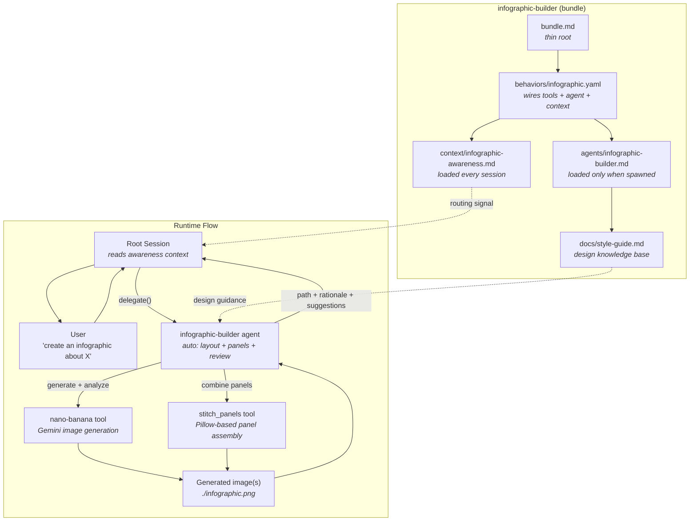

# infographic-builder

AI-powered infographic design and generation for Amplifier.

Say "create an infographic about X" and get a finished `.png` -- the agent handles
layout, color, typography, and composition automatically.

## What you can create

| Say this | You get |
|----------|---------| 
| "Create an infographic about the water cycle" | Single-panel infographic with auto-selected layout |
| "Make an infographic about the history of the internet" | Multi-panel series (auto-splits when content is dense) |
| "Create a comparison infographic: React vs Vue" | Side-by-side comparison layout |
| "Visualize our Q3 sales funnel with key metrics" | Statistics layout with large numbers and icons |
| "Make a 3-panel infographic about climate change" | Exactly 3 panels (your count, your call) |
| "Create a timeline of the space race" | Horizontal/vertical timeline layout |

The agent automatically:
- **Picks the best layout** for your content -- process flow, comparison, timeline, hierarchy, cycle, statistics, and more (12 layout types)
- **Splits complex topics** into multiple panels when there's too much for one image (up to 6 panels)
- **Reviews its own output** and refines if it spots issues (missing content, poor readability, wrong layout)
- **Stitches multi-panel sets** into a single combined image using the panel-stitching tool
- **Keeps multi-panel sets visually consistent** using reference image chaining

You steer with plain English:
- "make it bold and colorful" / "keep it minimal and corporate" -- style direction
- "use a timeline layout" -- override the automatic layout choice
- "single panel only" -- force one image even for dense topics
- "make it a 4-panel infographic" -- set an explicit panel count (up to 6)
- "skip the review" -- faster generation, skip the quality check

## Get started

### Prerequisites

- **Amplifier** installed and working (`amplifier --version`)
- **Google API key** with Gemini access -- this powers the image generation

### 1. Install

```bash
amplifier bundle add git+https://github.com/singh2/infographic-builder@main --app
```

Or add to an existing bundle's `bundle.md`:

```yaml
includes:
  - bundle: git+https://github.com/microsoft/amplifier-foundation@main
  - bundle: git+https://github.com/singh2/infographic-builder@main
```

### 2. Set your Google API key

```bash
export GOOGLE_API_KEY=your-key-here
```

To make it permanent, add that line to your `~/.zshrc` (or `~/.bashrc`).

### 3. Run

```bash
amplifier run
```

Then say something like:

```
Create an infographic about how DNS works
```

The agent takes over from there -- you'll get back `.png` file(s), a design rationale,
and suggestions for refinement.

### Where output goes

Generated images are saved to the current working directory:

| Output | Filename |
|--------|----------|
| Single-panel infographic | `./infographic.png` |
| Multi-panel set | `./infographic_panel_1.png`, `./infographic_panel_2.png`, ... |
| Stitched composite | `./infographic.png` (all panels combined vertically) |

## Sample gallery

The repo includes two recipes that batch-generate 14 infographic scenarios across
different panel counts (1 through 6) and topics. Use these to see what the tool
can do or to regression-test after changes.

```bash
# Generate all 14 scenarios with Gemini Pro
amplifier run
# Say: "execute recipes/generate-sample-gallery.yaml"

# Same scenarios with Gemini 3.1 Flash (faster, good for comparison)
amplifier run
# Say: "execute recipes/generate-sample-gallery-3.1-flash.yaml"
```

Output lands in `./samples/pro/` and `./samples/3.1-flash/` respectively.

The 14 scenarios cover: mechanical keyboards, noise-canceling headphones, SaaS metrics,
developer survey results, DNS, campfire building, agile vs waterfall, neural networks,
surfing, LLM training pipeline, song-to-Spotify, AI in everyday life, coffee bean
journey, and history of the internet.

## Pitfalls

| Problem | Cause | Fix |
|---------|-------|-----|
| Generation fails or "API key" error | Missing Google API key | `export GOOGLE_API_KEY=your-key` -- this is the #1 first-run issue |
| Wrong layout for your content | Agent's auto-detection missed | Tell it explicitly: "use a timeline layout" or "make it a comparison" |
| Too many panels (or too few) | Auto-split based on content density | Specify: "make it a 2-panel infographic" -- explicit count always wins |
| Multi-panel styles don't match | Rare -- Panel 1 is used as style anchor | Ask the agent to regenerate; Panel 1 sets the style for all others |
| Slow generation | Quality review adds ~10-20s per image | Say "skip the review" for faster output |
| Image text is garbled or unreadable | Limitation of current image generation models | Simplify: fewer data points, shorter labels, larger text emphasis in your prompt |

## How it works

```
1. You describe what you want
2. Agent analyzes content density --> picks single or multi-panel
3. Agent designs layout, palette, typography, and visual hierarchy
4. Agent generates image(s) via Gemini (nano-banana tool)
5. Agent reviews output and refines if needed
6. For multi-panel: agent stitches panels into a combined image
7. You get the .png file(s) + design rationale + suggestions
```

The agent's design decisions are guided by a comprehensive style guide
(`docs/style-guide.md`) covering 12 layout types, prompt engineering rules,
decomposition heuristics, multi-panel composition protocols, and quality
review criteria.

## Architecture


<details>
<summary>Mermaid version (click to expand)</summary>



</details>

## Project structure

```
infographic-builder/
|-- bundle.md                              # thin root: foundation + behavior
|-- behaviors/
|   +-- infographic.yaml                   # wires tools + agent + context
|-- agents/
|   +-- infographic-builder.md             # the expert agent (context sink)
|-- context/
|   +-- infographic-awareness.md           # thin pointer loaded every session
|-- docs/
|   |-- style-guide.md                     # design knowledge base (layouts, prompts, review criteria)
|   |-- architecture.dot                   # Graphviz source for architecture diagram
|   |-- architecture.png                   # rendered architecture diagram
|   +-- plans/
|       +-- 2026-03-20-style-system-design.md  # validated design for style system feature
|-- modules/
|   +-- tool-stitch-panels/                # Python module: combines panels into one image
|       |-- pyproject.toml
|       +-- amplifier_module_tool_stitch_panels/
|           +-- __init__.py                # StitchPanelsTool + mount() entry point
|-- recipes/
|   |-- generate-sample-gallery.yaml       # batch-generate 14 scenarios (Gemini Pro)
|   +-- generate-sample-gallery-3.1-flash.yaml  # same scenarios (Gemini 3.1 Flash)
+-- samples/                               # generated gallery output (gitignored)
    |-- pro/                               # Gemini Pro outputs
    +-- 3.1-flash/                         # Gemini 3.1 Flash outputs
```

## Roadmap

**Next up -- Style System and Browsable Catalog** (design complete, ready to implement):
Adds 6 curated visual aesthetics (clean minimalist, dark mode tech, bold editorial,
hand-drawn sketchnote, claymation studio, lego brick builder) plus freeform style
input, 4 new layout types, and a static catalog website showcasing all combinations.
See `docs/plans/2026-03-20-style-system-design.md` for the full design.

**Planned -- User-Provided Reference Images**:
When a user says "make it look like this" and provides an image, the agent should
pass it as `reference_image_path` to `nano-banana.generate`. The mechanism already
exists in the tool but the agent workflow doesn't handle user-supplied style
references yet. Blocked on understanding how Amplifier handles user-provided
image/file uploads natively.

## Local development

### Setup

Point Amplifier at the local checkout:

```yaml
# .amplifier/settings.yaml (in this repo, already gitignored)
default_bundle: file:///Users/YOU/path/to/infographic-builder
```

Or use source override if you already have a default bundle:

```yaml
# ~/.amplifier/settings.yaml
sources:
  infographic-builder: file:///Users/YOU/path/to/infographic-builder
```

### Prerequisites check

```bash
echo $GOOGLE_API_KEY   # should print your key
amplifier --version
```

### Smoke tests

```bash
cd /path/to/infographic-builder

# Test 1: Simple topic (should auto single-panel)
amplifier run
# Say: "Create an infographic about the water cycle"
# Expected: single panel, auto layout, quality review, design rationale

# Test 2: Complex topic (should auto multi-panel)
amplifier run
# Say: "Create an infographic about the complete history of the internet"
# Expected: agent auto-decomposes into multiple panels, stitches them together

# Test 3: User override -- explicit panel count
amplifier run
# Say: "Create a 3-panel infographic about how DNS works"
# Expected: exactly 3 panels

# Test 4: User override -- force single panel
amplifier run
# Say: "Create a single-panel infographic about climate change impacts"
# Expected: one image even though topic is dense
```

### What to check

| Check | What to look for |
|-------|------------------|
| Delegation | Root session delegates to `infographic-builder` (not handling it directly) |
| Image output | `.png` file(s) saved to disk at the reported path |
| Design rationale | Agent explains layout choice, palette, and reasoning |
| Quality review | Agent reports what the review found and whether it refined |
| Auto multi-panel | Dense topics get split into panels without being asked |
| Panel stitching | Multi-panel sets get combined into a single composite image |
| Style consistency | Multi-panel sets share the same color palette and typography |

## License

MIT
