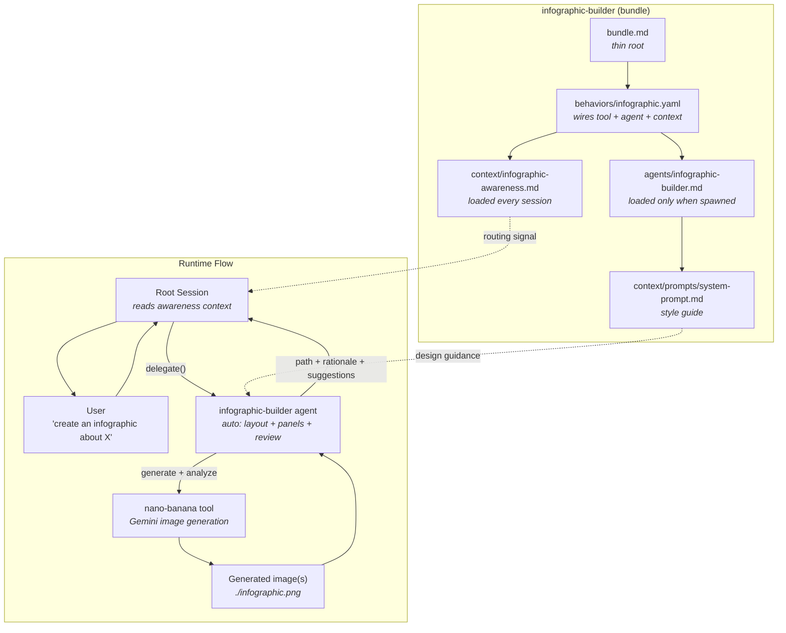

# infographic-builder

AI-powered infographic design and generation for Amplifier.

Say "create an infographic about X" and get a finished `.png` -- the agent handles
layout, color, typography, and composition automatically.

## What you can create

| Say this | You get |
|----------|---------|
| "Create an infographic about the water cycle" | Single-panel infographic with auto-selected layout |
| "Make an infographic about the history of the internet" | Multi-panel series (auto-splits when content is dense) |
| "Create a comparison infographic: React vs Vue" | Side-by-side comparison layout |
| "Visualize our Q3 sales funnel with key metrics" | Statistics layout with large numbers and icons |
| "Make a 3-panel infographic about climate change" | Exactly 3 panels (your count, your call) |
| "Create a timeline of the space race" | Horizontal/vertical timeline layout |

The agent automatically:
- **Picks the best layout** for your content -- process flow, comparison, timeline, hierarchy, cycle, or statistics
- **Splits complex topics** into multiple panels when there's too much for one image
- **Reviews its own output** and refines if it spots issues (missing content, poor readability, wrong layout)
- **Keeps multi-panel sets visually consistent** using reference image chaining

You steer with plain English:
- "make it bold and colorful" / "keep it minimal and corporate" -- style direction
- "use a timeline layout" -- override the automatic layout choice
- "single panel only" -- force one image even for dense topics
- "make it a 4-panel infographic" -- set an explicit panel count (up to 6)
- "skip the review" -- faster generation, skip the quality check

## Get started

**1. Install**

```bash
amplifier bundle add git+https://github.com/singh2/infographic-builder@main --app
```

Or add to an existing bundle:

```yaml
includes:
  - bundle: foundation
  - bundle: git+https://github.com/singh2/infographic-builder@main
```

**2. Set your Google API key** (required for Gemini image generation)

```bash
export GOOGLE_API_KEY=your-key-here
```

**3. Go**

```bash
amplifier run
# Then say: "Create an infographic about [anything]"
```

## Pitfalls

| Problem | Cause | Fix |
|---------|-------|-----|
| Generation fails or "API key" error | Missing Google API key | `export GOOGLE_API_KEY=your-key` -- this is the #1 first-run issue |
| Wrong layout for your content | Agent's auto-detection missed | Tell it explicitly: "use a timeline layout" or "make it a comparison" |
| Too many panels (or too few) | Auto-split based on content density | Specify: "make it a 2-panel infographic" -- explicit count always wins |
| Multi-panel styles don't match | Rare -- Panel 1 is used as style anchor | Ask the agent to regenerate; Panel 1 sets the style for all others |
| Slow generation | Quality review adds ~10-20s per image | Say "skip the review" for faster output |
| Image text is garbled or unreadable | Limitation of current image generation models | Simplify: fewer data points, shorter labels, larger text emphasis in your prompt |

## How it works

```
1. You describe what you want
2. Agent analyzes content density --> picks single or multi-panel
3. Agent designs layout, palette, typography, and visual hierarchy
4. Agent generates image(s) via Gemini (nano-banana tool)
5. Agent reviews output and refines if needed
6. You get the .png file(s) + design rationale + suggestions
```

## Architecture


<details>
<summary>Mermaid version (click to expand)</summary>



</details>

## Structure

```
infographic-builder/
|-- bundle.md                        # thin root: foundation + nano-banana + behavior
|-- behaviors/
|   +-- infographic.yaml             # wires tool + agent + context
|-- agents/
|   +-- infographic-builder.md       # the expert agent (context sink)
+-- context/
    |-- infographic-awareness.md     # thin pointer loaded every session
    +-- prompts/
        +-- system-prompt.md         # infographic generation style guide
```

## Advanced: environment overrides

For persistent preferences, you can opt out of defaults with environment variables:

| Env Var | Default | Effect |
|---------|---------|--------|
| `INFOGRAPHIC_CRITIC=false` | on | Skip quality review (faster, but no self-correction) |
| `INFOGRAPHIC_MULTI_PANEL=false` | auto | Force single panel even for complex topics |

These are opt-**out** overrides. By default, the agent decides everything automatically.
Most users will never need these -- use natural language instead ("skip the review",
"single panel only").

## Testing

### Local development setup

Point Amplifier at the local checkout:

```yaml
# .amplifier/settings.yaml (in this repo, already gitignored)
default_bundle: file:///Users/YOU/path/to/infographic-builder
```

Or use source override if you already have a default bundle:

```yaml
# ~/.amplifier/settings.yaml
sources:
  infographic-builder: file:///Users/YOU/path/to/infographic-builder
```

### Prerequisites check

```bash
echo $GOOGLE_API_KEY   # should print your key
amplifier --version
```

### Smoke tests

```bash
cd /path/to/infographic-builder

# Test 1: Simple topic (should auto single-panel)
amplifier run
# Say: "Create an infographic about the water cycle"
# Expected: single panel, auto layout, quality review, design rationale

# Test 2: Complex topic (should auto multi-panel)
amplifier run
# Say: "Create an infographic about the complete history of the internet"
# Expected: agent auto-decomposes into multiple panels

# Test 3: User override -- explicit panel count
amplifier run
# Say: "Create a 3-panel infographic about how DNS works"
# Expected: exactly 3 panels

# Test 4: User override -- force single panel
amplifier run
# Say: "Create a single-panel infographic about climate change impacts"
# Expected: one image even though topic is dense
```

### What to check

| Check | What to look for |
|-------|------------------|
| Delegation | Root session delegates to `infographic-builder` (not handling it directly) |
| Image output | `.png` file(s) saved to disk at the reported path |
| Design rationale | Agent explains layout choice, palette, and reasoning |
| Quality review | Agent reports what the review found and whether it refined |
| Auto multi-panel | Dense topics get split into panels without being asked |
| Style consistency | Multi-panel sets share the same color palette and typography |

## License

MIT
