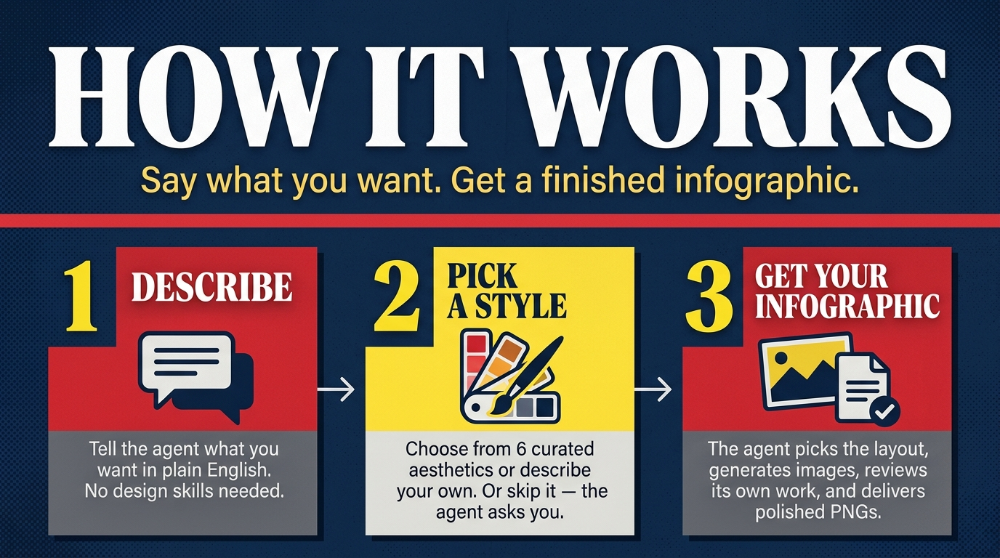
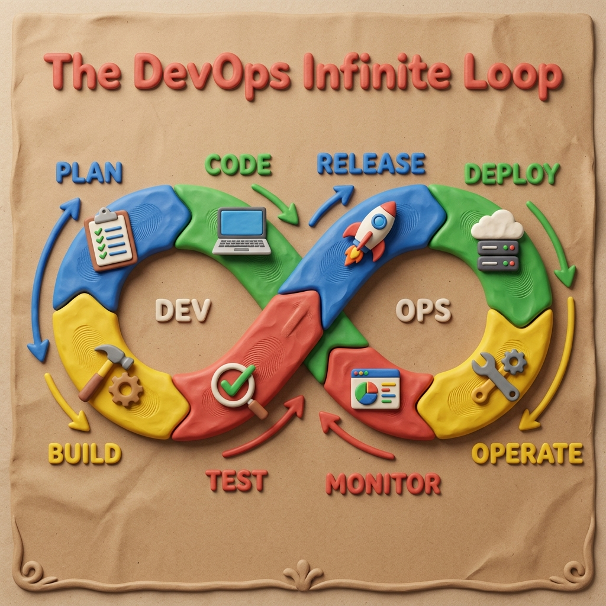
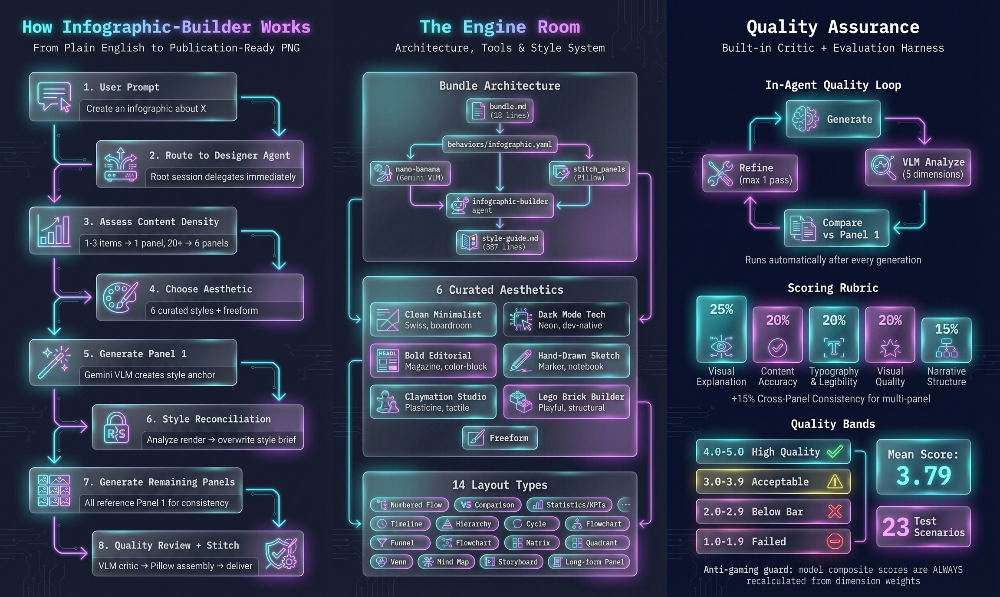
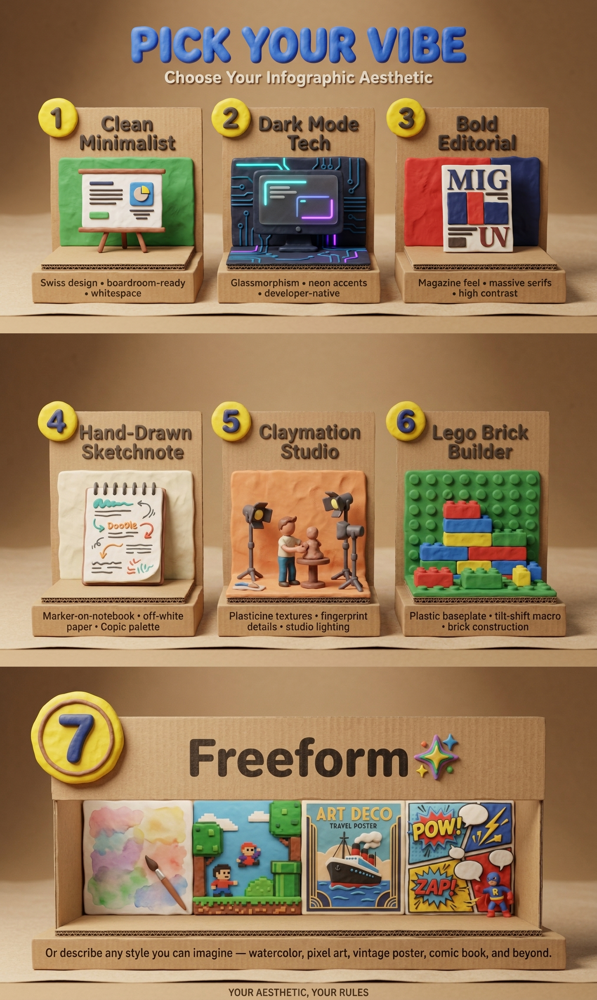
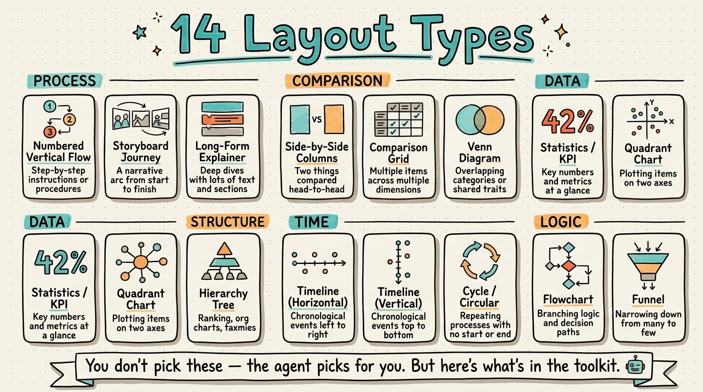
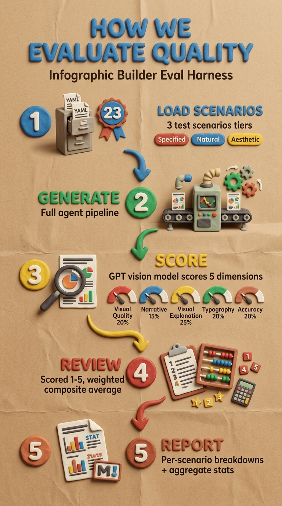
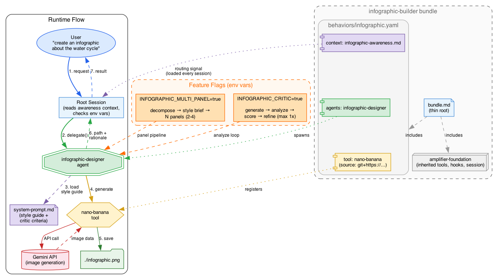
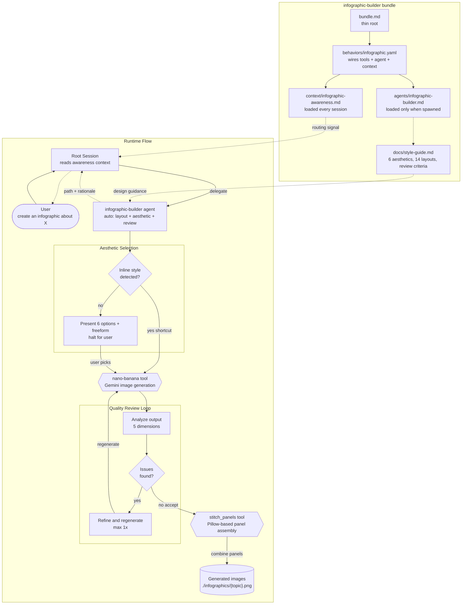

# infographic-builder

[](LICENSE)
[](https://github.com/microsoft/amplifier)
[](https://ai.google.dev/)

<div align="center">
  
  <br><br>
  <strong>Say what you want, get a finished infographic.</strong>
  <br>
  The agent handles layout, color, typography, and multi-panel composition automatically.
  <br>You steer with plain English.
</div>

<br>

## Contents

- [Get started](#get-started)
- [Examples](#examples)
- [Pick your style](#pick-your-style)
- [The right layout, picked automatically](#the-right-layout-picked-automatically)
- [Every panel matches](#every-panel-matches)
- [Vetted for quality](#vetted-for-quality)
- [Troubleshooting](#troubleshooting)
- [Contributing](#contributing)
- [License](#license)

## Get started

infographic-builder runs inside [Amplifier](https://github.com/microsoft/amplifier) — an open-source AI agent runtime. Install Amplifier first, then add this bundle:

```bash
amplifier bundle add git+https://github.com/singh2/infographic-builder@main --app
```

Set your Google API key (powers the image generation):

```bash
export GOOGLE_API_KEY=your-key-here   # add to ~/.zshrc to make permanent
```

Start a session and try it:

```
"create an infographic about the water cycle"
```

You'll get back `.png` file(s), a design rationale, and suggestions for refinement.

### Controls

| Control | Example |
|---------|---------|
| **Aesthetic** | `"make it claymation"` / `"dark mode tech"` / `"keep it minimal and corporate"` |
| **Layout** | `"use a timeline layout"` / `"make it a comparison"` |
| **Panels** | `"single panel only"` / `"make it a 4-panel infographic"` |
| **Orientation** | `"horizontal panels"` / `"vertical panels"` |
| **Skip review** | `"skip the review"` — faster generation, no quality check pass |

### Where output goes

| Output | Filename |
|--------|----------|
| Single-panel infographic | `./infographics/{topic}.png` |
| Multi-panel set | `./infographics/{topic}_panel_1.png`, `{topic}_panel_2.png`, ... |
| Stitched composite | `./infographics/{topic}_combined.png` |

The filename is derived from your topic automatically. If you specify an output path explicitly, it's used as-is.

## Examples

<table>
  <tr>
    <td></td>
    <td></td>
    <td></td>
  </tr>
  <tr>
    <td align="center"><em>DevOps Lifecycle<br/>Claymation Studio</em></td>
    <td align="center"><em>How Surfing Works<br/>Bold Editorial · 3 panels</em></td>
    <td align="center"><em>How Infographic-Builder Works<br/>Dark Mode Tech · 3 panels</em></td>
  </tr>
</table>

<br>

### What to ask for

**Dev teams** — feed it the artifacts you already have

- `"Show me a diagram of how our app works"` — reads your codebase and generates an architecture visual
- `"Summarize this repo's last week of commits as a visual timeline"` — analyzes git history, auto-selects a timeline
- `"Create a visual changelog from the last 3 releases"` — turns release notes into a visual narrative
- `"Make an onboarding guide for new engineers joining this repo"` — reads the codebase and generates a visual walkthrough
- `"Visualize our test coverage by module"` — reads test output, creates a breakdown by area
- `"Here's our open issues — make an infographic of the top bug themes"` — clusters and ranks issue patterns
- `"Here's our incident postmortem — make a timeline of what happened"` — turns a doc into a narrative timeline

**Knowledge work** — meetings, decisions, progress

- `"Here's meeting.vtt — visualize the key decisions and action items"` — extracts structure from the transcript, picks the right layout
- `"Summarize this strategy doc as a one-pager visual"` — condenses a long doc into a scannable infographic
- `"Here's our quarterly OKR sheet — visualize progress"` — turns a spreadsheet-style doc into a dashboard
- `"Explain how LLMs work — make it visual"` — breaks down a complex topic into an educational infographic

**For fun**

- `"Make a claymation guide to brewing the perfect espresso"` — detects style inline, auto-picks a process flow
- `"Infographic ranking every Star Wars movie"` — auto-splits into panels when content is dense
- `"Create a travel planning infographic for my Japan trip"` — turns an itinerary into a visual journey

## Pick your style

<div align="center">
  
</div>

<br>

Six curated aesthetics — from **Clean Minimalist** (boardroom-ready) to **Lego Brick Builder** (plastic studs and tilt-shift macro photography) — plus **Freeform** for anything you can describe.

Say it inline (`"make a claymation infographic about..."`) and the agent skips straight to generation. Or leave it open and you'll get a menu to choose from.

---

## The right layout, picked automatically

<div align="center">
  
</div>

<br>

The agent analyzes your content and picks the best layout automatically — process flow, comparison grid, timeline, hierarchy, funnel, mind map, and more.

You never need to think about this. But if you want to override: `"use a timeline layout"` or `"make it a comparison"`.

---

## Every panel matches

<div align="center">
  
</div>

<br>

Dense topics are automatically split into up to 6 panels. The hard part is keeping them visually consistent.

**Panel 1 is the style anchor.** After it renders, the agent analyzes what Gemini *actually produced* — not what was planned — and overwrites the style brief. Every subsequent panel is generated with Panel 1's image as a reference. After generation, each panel is compared against Panel 1 across 8 visual dimensions.

> *The render wins. Not the plan.*

---

## Vetted for quality

<div align="center">
  
</div>

<br>

Every infographic goes through a self-critique loop on 5 dimensions before delivery. If issues are found, the agent refines and regenerates (max once).

The project also includes a **standalone evaluation harness** for batch-testing across 23 scenarios using OpenAI vision scoring.

<details>
<summary>Scoring rubric and running evaluations</summary>

<br>

### Scoring rubric

| Dimension | Weight | What it measures |
|-----------|--------|------------------|
| Visual Explanation | 25% | How effectively visuals communicate the core idea |
| Content Accuracy | 20% | Factual correctness, absence of hallucinated data |
| Typography & Legibility | 20% | Font hierarchy, contrast, readability |
| Visual Quality & Consistency | 20% | Polish, palette coherence, icon consistency |
| Narrative Structure | 15% | Logical flow, entry/exit points, story progression |

Plus an unweighted **prompt fidelity** score (1-5) measuring adherence to the original brief.

The model's own composite estimate is always discarded — `parse_scores()` recalculates
it from dimension scores × weights as a guard against model self-reporting bias.

### Quality bands

| Score | Band |
|-------|------|
| 4.0 - 5.0 | High quality |
| 3.0 - 3.9 | Acceptable |
| 2.0 - 2.9 | Below bar |
| 1.0 - 1.9 | Failed |

### Running evaluations

Requires `OPENAI_API_KEY` set in your environment.

```bash
# Score a single scenario
python -m eval evaluate \
  --scenario-file eval/scenarios.yaml \
  --scenario-name dns \
  --image-dir eval-results/run-name/dns/ \
  --output eval-results/run-name/dns/dns_scores.json

# Generate a markdown report from all scored scenarios
python -m eval report \
  --run-dir eval-results/run-name/ \
  --baseline-dir eval-results/previous-run/   # optional: adds trend deltas
```

Or run the full pipeline as an Amplifier recipe:

```bash
amplifier run
# Say: "execute recipes/evaluate.yaml"
```

The recipe automates: setup -> load scenarios -> generate infographics (foreach) ->
evaluate each scenario -> generate summary report.

</details>

---

## Troubleshooting

| Problem | Fix |
|---------|-----|
| "API key" error on first run | `export GOOGLE_API_KEY=your-key` — the #1 first-run issue |
| Image text is garbled or unreadable | Simplify: fewer data points, shorter labels, larger text emphasis in your prompt |
| Wrong layout for your content | Tell it explicitly: "use a timeline layout" or "make it a comparison" |
| Too many panels (or too few) | Specify: "make it a 2-panel infographic" -- explicit count always wins |
| Slow generation | Say "skip the review" to skip the quality check pass |

---

<details>
<summary><strong>Architecture</strong></summary>

<br>



<details>
<summary>Mermaid version</summary>



</details>

</details>

<details>
<summary><strong>For bundle authors</strong></summary>

<br>

Add to your `bundle.md`:

```yaml
includes:
  - bundle: git+https://github.com/singh2/infographic-builder@main
```

No need to separately add `amplifier-foundation` — it's included.

</details>

<details>
<summary><strong>Project structure</strong></summary>

<br>

```
infographic-builder/
|-- bundle.md                              # thin root: foundation + behavior
|-- behaviors/
|   +-- infographic.yaml                   # wires tools + agent + context
|-- agents/
|   +-- infographic-builder.md             # the expert agent (context sink)
|-- context/
|   +-- infographic-awareness.md           # thin pointer loaded every session
|-- docs/
|   |-- style-guide.md                     # design knowledge: aesthetics, layouts, quality criteria
|   |-- architecture.dot                   # Graphviz source for architecture diagram
|   |-- architecture.png                   # rendered architecture diagram
|   |-- evaluation.dot                     # Graphviz source for evaluation process diagram
|   |-- evaluation.png                     # rendered evaluation process diagram
|   |-- readme/                            # infographics used in this README
|   |-- showcase/                          # hero showcase images
|   |-- examples/                          # curated example outputs
|   +-- plans/                             # design documents
|-- modules/
|   +-- tool-stitch-panels/                # Python module: combines panels into one image
|       |-- pyproject.toml
|       +-- amplifier_module_tool_stitch_panels/
|           +-- __init__.py                # StitchPanelsTool + mount() entry point
|-- eval/
|   |-- __init__.py                        # package marker
|   |-- __main__.py                        # enables python -m eval
|   |-- cli.py                             # evaluate + report subcommands
|   |-- rubric.py                          # scoring rubric, prompt builder, OpenAI vision evaluation
|   |-- report.py                          # score aggregation + markdown report generation
|   +-- scenarios.yaml                     # 23 test scenarios (1-6 panels)
|-- recipes/
|   |-- evaluate.yaml                      # full evaluation pipeline recipe
|   |-- generate-sample-gallery.yaml       # batch-generate 14 scenarios (Gemini Pro)
|   +-- generate-sample-gallery-3.1-flash.yaml  # same scenarios (Gemini 3.1 Flash)
|-- tests/                                 # pytest test suite
|-- eval-results/                          # persisted evaluation runs
+-- samples/                               # generated gallery output
    |-- readme/                            # infographics used in this README
    |-- pro/                               # Gemini Pro outputs
    +-- 3.1-flash/                         # Gemini 3.1 Flash outputs
```

</details>

<details>
<summary><strong>Roadmap</strong></summary>

<br>

**Shipped — Style System**:
Six curated aesthetics (Clean Minimalist, Bold Editorial, Claymation Studio, Dark Mode Tech,
Hand-Drawn Sketchnote, Lego Brick Builder) with full prompt templates. Layout selection covers 14 types.

**Planned — User-Provided Reference Images**:
When a user says "make it look like this" and provides an image, the agent should
pass it as `reference_image_path` to `nano-banana.generate`. The mechanism already
exists in the tool but the agent workflow doesn't handle user-supplied style
references yet.

**Planned — Browsable Style Catalog**:
A static site showcasing all aesthetic x layout combinations so users can browse
what's possible before asking for a specific style.

</details>

<details>
<summary><strong>Local development</strong></summary>

<br>

### Setup

Point Amplifier at the local checkout:

```yaml
# .amplifier/settings.yaml (in this repo, already gitignored)
default_bundle: file:///Users/YOU/path/to/infographic-builder
```

Or use source override if you already have a default bundle:

```yaml
# ~/.amplifier/settings.yaml
sources:
  infographic-builder: file:///Users/YOU/path/to/infographic-builder
```

### Prerequisites check

```bash
echo $GOOGLE_API_KEY   # should print your key
amplifier --version
```

### Smoke tests

```bash
cd /path/to/infographic-builder

# Test 1: Simple topic (should auto single-panel)
amplifier run
# Say: "Create an infographic about the water cycle"
# Expected: single panel, auto layout, quality review, design rationale

# Test 2: Complex topic (should auto multi-panel)
amplifier run
# Say: "Create an infographic about the complete history of the internet"
# Expected: agent auto-decomposes into multiple panels, stitches them together

# Test 3: User override -- explicit panel count
amplifier run
# Say: "Create a 3-panel infographic about how DNS works"
# Expected: exactly 3 panels

# Test 4: User override -- force single panel
amplifier run
# Say: "Create a single-panel infographic about climate change impacts"
# Expected: one image even though topic is dense

# Test 5: Aesthetic selection flow
amplifier run
# Say: "Create an infographic about how HTTPS works"
# Expected: Agent recommends layout, presents 6 aesthetic options + freeform
# Pick: "2" or "Dark Mode Tech"
# Expected: Infographic generated in Dark Mode Tech style

# Test 6: Inline aesthetic shortcut (skips aesthetic prompt)
amplifier run
# Say: "Make a claymation infographic about the nitrogen cycle"
# Expected: Skips aesthetic proposal, generates directly in Claymation style
```

### What to check

| Check | What to look for |
|-------|------------------|
| Delegation | Root session delegates to `infographic-builder` (not handling it directly) |
| Image output | `.png` file(s) saved to disk at the reported path |
| Design rationale | Agent explains layout choice, palette, and reasoning |
| Quality review | Agent reports what the review found and whether it refined |
| Auto multi-panel | Dense topics get split into panels without being asked |
| Panel stitching | Multi-panel sets get combined into a single composite image |
| Style consistency | Multi-panel sets share the same color palette and typography |
| Aesthetic selection | Agent presents 6 options + freeform and waits for user choice |
| Inline style shortcut | Specifying aesthetic in the request skips the proposal turn |
| Aesthetic fidelity | Quality review includes aesthetic match as a review dimension |

</details>

<br>

## Contributing

Issues and PRs are welcome. See the [Local development](#local-development) section to get set up.

## License

[MIT](LICENSE) © 2026 Gurkaran Singh
